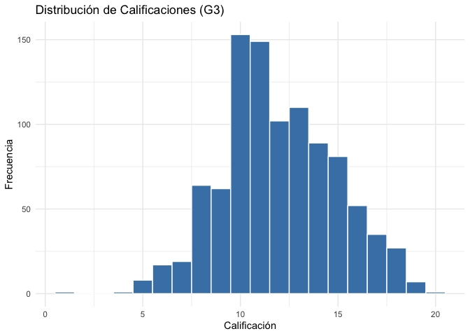

Uso de R para consultas MySQL
================

## 1) Librerias necesarias para la conexión.

``` r
#Necesarias para la conexión de R - MySQL TEST
library(DBI) 
library(RMariaDB)

#En caso de desear hacer consultas y manipular los datos usando la lógica dplyr
library(dplyr)
library(dbplyr)

#Librerias de formato para visualizar la información
library(flextable)
library(formattable)
library(ggplot2)
library(knitr)
```

## 2) Conexión a una base de datos de MySQL desde R

``` r
con <- dbConnect(
  RMariaDB::MariaDB(),
  host     = "localhost",
  port     = 3306,
  user     = "root", #colocar usario MySQL
  password = rstudioapi::askForPassword("MySQL password"), #Ventana emergente para solicitar password
  dbname   = "StudentsPerformance_OfficialDB" #Cambiar aqui por la base de datos que se desea conectar
)
```

## 3) Revisar las tablas existentes en la base de datos asi como los atributos de cada tabla:

``` r
dbListTables(con) #Revisa tablas en la base de datos
```

    ## [1] "Course"  "Grades"  "School"  "Student"

``` r
dbListFields(con, "Grades") #Revisa los atributos de una de las tablas
```

    ## [1] "student_id" "course_id"  "G1"         "G2"         "G3"

## 4) Consulta a la base de datos manteniendo el languaje SQL:

``` r
dbReadTable(con, "School") #Extrae todos los datos de una de las tablas
```

    ##   school_id                 name
    ## 1        GP      Gabriel Pereira
    ## 2        MS Mousinho da Silveira

``` r
formattable(dbReadTable(con, "School"))
```

<table class="table table-condensed">
<thead>
<tr>
<th style="text-align:right;">
school_id
</th>
<th style="text-align:right;">
name
</th>
</tr>
</thead>
<tbody>
<tr>
<td style="text-align:right;">
GP
</td>
<td style="text-align:right;">
Gabriel Pereira
</td>
</tr>
<tr>
<td style="text-align:right;">
MS
</td>
<td style="text-align:right;">
Mousinho da Silveira
</td>
</tr>
</tbody>
</table>

``` r
califs <- dbGetQuery(con, "SELECT * FROM Grades")
knitr::kable(head(califs))
```

| student_id | course_id |  G1 |  G2 |  G3 |
|-----------:|----------:|----:|----:|----:|
|          1 |         1 |   5 |   6 |   6 |
|          1 |         2 |   0 |  11 |  11 |
|          2 |         1 |   5 |   5 |   6 |
|          2 |         2 |   9 |  11 |  11 |
|          3 |         1 |   7 |   8 |  10 |
|          3 |         2 |  12 |  13 |  12 |

``` r
res <- dbGetQuery(con, "
  SELECT student_id, course_id, G3
  FROM Grades
  WHERE G3 > 15
  LIMIT 10
")

knitr::kable(res)
```

| student_id | course_id |  G3 |
|-----------:|----------:|----:|
|          9 |         1 |  19 |
|          9 |         2 |  17 |
|         15 |         1 |  16 |
|         16 |         2 |  17 |
|         23 |         1 |  16 |
|         32 |         1 |  17 |
|         33 |         1 |  16 |
|         37 |         1 |  18 |
|         43 |         1 |  18 |
|         48 |         1 |  20 |

## 5) Creación de tablas

``` r
df <- data.frame(
  name = c("Ana", "Luis", "María"),
  score = c(10, 11, 12)
)

dbWriteTable(
  con,
  "scores",
  df,
  overwrite = TRUE,
  field.types = c(name = "VARCHAR(20)", score = "INT")
)

#La tabla nueva creada en la base de datos se ve de la siguiente manera:
flextable(dbGetQuery(con, "SELECT * FROM scores"))
```


``` r
new_df <- data.frame(
  name = c("Carlos", "Elena"),
  score = c(13, 14)
)

dbWriteTable(con, "scores", new_df, append = TRUE)
#Aquí usamos append = TRUE para añadir filas sin eliminar lo ya existente

#La tabla nueva creada con los nuevos registros en la base de datos se ve de la siguiente manera:
flextable(dbGetQuery(con, "SELECT * FROM scores"))
```


## 6) Creación de tablas

``` r
# Verifica que la tabla existe, en caso de que si, borrarla

if ( dbExistsTable(con, "scores") == TRUE) { dbRemoveTable(con, "scores") }
```

## 7) Uso de dplyr para consultas

``` r
grades_tbl <- tbl(con, "Grades")

grades_high <- grades_tbl %>%
  filter(G3 > 0) %>%
  select(student_id, course_id, G3) %>%
  collect()

head(grades_high)
```

    ## # A tibble: 6 × 3
    ##   student_id course_id    G3
    ##        <int>     <int> <int>
    ## 1          1         1     6
    ## 2          1         2    11
    ## 3          2         1     6
    ## 4          2         2    11
    ## 5          3         1    10
    ## 6          3         2    12

``` r
hist(grades_high$G3)
```


``` r
ggplot(grades_high, aes(x = G3)) +
  geom_histogram(binwidth = 1, fill = "steelblue", color = "white") +
  labs(title = "Distribución de Calificaciones (G3)",
       x = "Calificación",
       y = "Frecuencia") +
  theme_minimal()
```



## 9) Importante al final, desconectar la sesión

``` r
  dbDisconnect(con)
```
