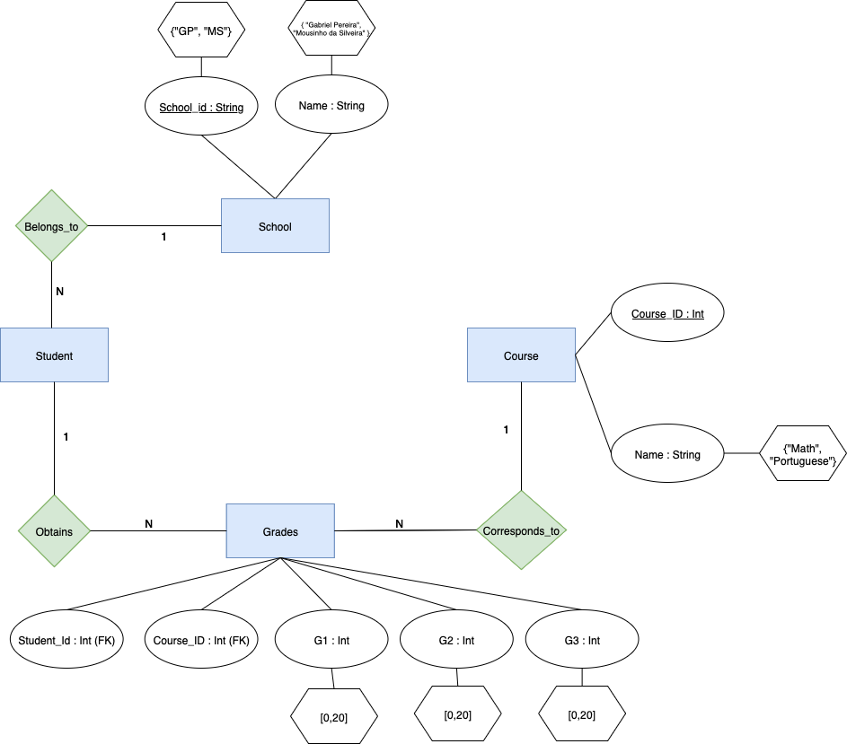

# Tarea 2 (Base de Datos Relacionales)

## Modelo Entidad - Relación

El siguiente modelo entidad-relación describe la estructura de la base de datos diseñada para gestionar información de escuelas, estudiantes, cursos y calificaciones.

El modelo describe las entidades principales, sus atributos y las relaciones entre ellas, considerando las claves primarias, claves foráneas y dominios de los atributos. Este diseño busca garantizar la integridad de los datos y facilitar consultas relacionadas con estudiantes, escuelas, cursos y calificaciones.

### Diagrama Entidad-Relación

#### Atributos de la Entidad "Student"

## Descripción general

- **SCHOOL**: Representa las escuelas. Cada escuela tiene un identificador y un nombre.  
- **STUDENT**: Contiene los datos de los estudiantes y su relación con la escuela a la que pertenecen.  
- **COURSE**: Incluye los cursos ofrecidos por cada escuela.  
- **GRADES**: Almacena las calificaciones de los estudiantes en los diferentes cursos.

El modelo incluye las siguientes relaciones:
- Cada estudiante pertenece a una escuela (N:1).
- Cada curso es ofrecido por una escuela (N:1).
- Las calificaciones relacionan a estudiantes con cursos (N:N resuelto mediante la entidad GRADES).

(Tarea1/Tarea1.md)