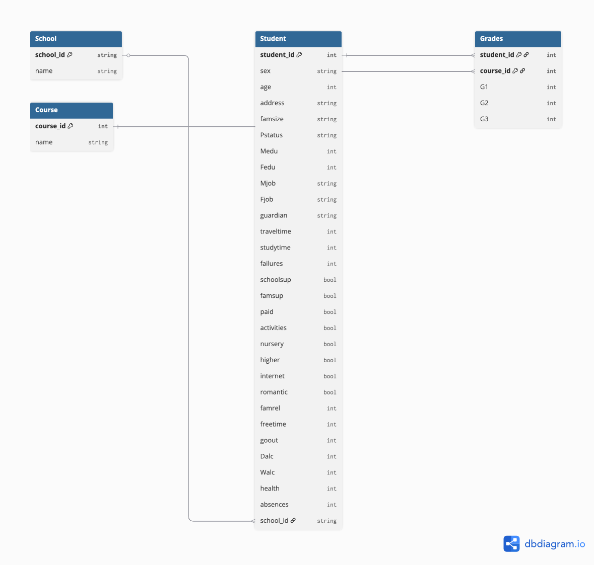

# Tarea 3 (Base de Datos Relacionales)

## Modelo Relacional

### School →

School(**school_id** (PK), name)

---

### Student →

Student(**student_id** (PK), sex, age, address, famsize, Pstatus, Medu, Fedu, Mjob, Fjob, guardian, traveltime, studytime, failures, schoolsup, famsup, paid, activities, nursery, higher, internet, romantic, famrel, freetime, goout, Dalc, Walc, health, absences, school_id (FK) )

---

### Course →

Course(**course_id** (PK), name )

---

### Grades (tambien se le puede llamar Student_Course) →

Grades(**student_id** (FK), **course_id** (FK), G1, G2, G3 )

---

### Diagrama (Modelo Relacional)

**- [Revisar Tarea 1 para conocer mas detalles de cada atributo.](../Tarea1/Tarea1.md)**  

**- [Revisar Tarea 2 para observar el diagrama entidad-relación de este conjunto de datos.](../Tarea2/Tarea2.md)**  