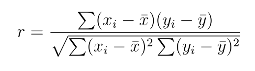
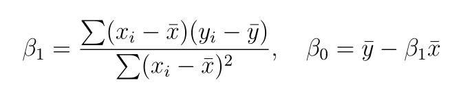

# Tarea 9 (Base de Datos Relacionales)

## Funciones y Procedimientos en SQL 

En este documento se presenta la implementación de dos procedimientos almacenados en SQL para el análisis estadístico de datos:

1. **Correlación de Pearson**: permite medir la fuerza y dirección de la relación lineal entre dos variables numéricas.
2. **Regresión lineal simple**: ajusta un modelo lineal de la forma Y = beta_0 + beta_1*X, estimando los coeficientes mediante mínimos cuadrados.

Ambos procedimientos han sido desarrollados utilizando funciones básicas de MySQL y se aplican a datos ficticios que simulan la relación entre horas de estudio (`X`) y calificaciones obtenidas (`Y`). Los resultados permiten identificar tanto la intensidad de la relación como un modelo predictivo entre las variables.

A continuación, se detallan los datos utilizados, el código SQL implementado y una breve explicación del funcionamiento de cada procedimiento.

### Conjunto de datos:

```sql


DROP DATABASE IF EXISTS Tarea9;
CREATE DATABASE Tarea9;
USE Tarea9;


-- Borrar si existen
DROP TABLE IF EXISTS X;
DROP TABLE IF EXISTS Y;

-- Crear tabla X
CREATE TABLE X (
  id INT PRIMARY KEY,
  val DECIMAL(5,2) -- horas estudiadas
);

-- Crear tabla Y
CREATE TABLE Y (
  id INT PRIMARY KEY,
  val DECIMAL(5,2) -- calificación
);

-- Insertar valores en X
INSERT INTO X (id, val) VALUES
(1, 1.0),
(2, 2.0),
(3, 3.0),
(4, 4.0),
(5, 5.0),
(6, 6.0),
(7, 7.0);

-- Insertar valores en Y
INSERT INTO Y (id, val) VALUES
(1, 2.0),
(2, 3.8),
(3, 5.0),
(4, 6.2),
(5, 7.9),
(6, 9.1),
(7, 10.0);

SELECT 
  X.id,
  X.val AS X,
  Y.val AS Y
FROM X
JOIN Y ON X.id = Y.id;

```

De manera ilustrativa, este es el conjunto de datos creado en SQL:

| id | X (horas de estudio) | Y (calificación) |
|----|----------------------|------------------|
| 1  | 1                    | 2.0              |
| 2  | 2                    | 3.8              |
| 3  | 3                    | 5.0              |
| 4  | 4                    | 6.2              |
| 5  | 5                    | 7.9              |
| 6  | 6                    | 9.1              |
| 7  | 7                    | 10.0             |

### 1) Correlación entre dos conjuntos de datos

La fórmula de la **correlación de Pearson** entre dos variables \( X \) y \( Y \) es:



```sql

DROP PROCEDURE IF EXISTS calcular_correlacion;
DELIMITER //

CREATE PROCEDURE calcular_correlacion(OUT resultado DECIMAL(10,5))
BEGIN
  DECLARE media_x DECIMAL(10,5);
  DECLARE media_y DECIMAL(10,5);
  DECLARE suma_prod DECIMAL(10,5);
  DECLARE suma_x2 DECIMAL(10,5);
  DECLARE suma_y2 DECIMAL(10,5);

  SELECT AVG(val) INTO media_x FROM X;
  SELECT AVG(val) INTO media_y FROM Y;

  SELECT 
    SUM((X.val - media_x) * (Y.val - media_y)),
    SUM(POW(X.val - media_x, 2)),
    SUM(POW(Y.val - media_y, 2))
  INTO 
    suma_prod, suma_x2, suma_y2
  FROM X
  JOIN Y ON X.id = Y.id;

  -- Calcular la correlación
  SET resultado = suma_prod / (SQRT(suma_x2) * SQRT(suma_y2));
END //

DELIMITER ;

CALL calcular_correlacion(@r);
SELECT @r AS correlacion;

```

El resultado del procedure es:

| correlacion |
|-------------|
| 0.99697     |

Este valor indica una **fuerte correlación lineal positiva** entre las variables `X` (horas de estudio) y `Y` (calificación). Es decir, a medida que aumentan las horas de estudio, también tiende a aumentar la calificación obtenida.

Dado que el valor está muy cerca de 1, podemos afirmar que existe una **relación lineal casi perfecta** entre ambas variables en este conjunto de datos.

#### Guía de interpretación del coeficiente \( r \):

| Valor de \( r \)      | Interpretación                         |
|------------------------|-----------------------------------------|
| \( r = 1 \)            | Correlación positiva perfecta           |
| \( 0.7 < r < 1 \)      | Correlación positiva fuerte             |
| \( 0.3 < r <= 0.7 \) | Correlación positiva moderada           |
| \( 0 < r <= 0.3 \)   | Correlación positiva débil              |
| \( r = 0 \)            | Sin correlación lineal                  |
| \( -0.3 <= r < 0 \)  | Correlación negativa débil              |
| \( -0.7 <= r < -0.3 \) | Correlación negativa moderada        |
| \( -1 < r < -0.7 \)    | Correlación negativa fuerte             |
| \( r = -1 \)           | Correlación negativa perfecta           |

### 2) Regresión lineal entre dos variables

## 2) Regresión lineal simple

La **regresión lineal simple** permite ajustar un modelo de la forma: Y = beta_0 + beta_1*X

donde:
- \( Y \) es la variable dependiente (calificación),
- \( X \) es la variable independiente (horas de estudio),
- \( beta_0 \) es la ordenada al origen (intercepto),
- \( beta_1 \) es la pendiente del modelo (efecto de una unidad de X sobre Y).

Para estimar los parámetros, se utilizan las siguientes fórmulas:



A continuación se presenta un procedimiento en SQL que calcula estos coeficientes a partir de los datos en las tablas `X` y `Y`.

```sql

DROP PROCEDURE IF EXISTS regresion_lineal;
DELIMITER //

CREATE PROCEDURE regresion_lineal(
  OUT beta_0 DECIMAL(10,5),
  OUT beta_1 DECIMAL(10,5)
)
BEGIN
  DECLARE media_x DECIMAL(10,5);
  DECLARE media_y DECIMAL(10,5);
  DECLARE suma_xy DECIMAL(10,5);
  DECLARE suma_x2 DECIMAL(10,5);

  -- Calcular medias
  SELECT AVG(val) INTO media_x FROM X;
  SELECT AVG(val) INTO media_y FROM Y;

  -- Calcular numerador y denominador para beta_1
  SELECT 
    SUM((X.val - media_x) * (Y.val - media_y)),
    SUM(POW(X.val - media_x, 2))
  INTO 
    suma_xy, suma_x2
  FROM X
  JOIN Y ON X.id = Y.id;

  -- Calcular pendiente y ordenada al origen
  SET beta_1 = suma_xy / suma_x2;
  SET beta_0 = media_y - beta_1 * media_x;
END //

DELIMITER ;

```

Después de ejecutar el procedimiento `regresion_lineal`, se obtuvieron los siguientes coeficientes:

| beta_0 (intercepto) | beta_1 (pendiente) |
|---------------------|--------------------|
| 0.92855             | 1.33929            |

**Interpretación del modelo:**

La ecuación del modelo ajustado es:

Y = 0.92855 + 1.33929X

Esto significa que:
- Cuando las horas de estudio (`X`) son 0, la calificación esperada (`Y`) es aproximadamente 0.93.
- Por cada hora adicional de estudio, la calificación aumenta en promedio **1.34 puntos**.

El modelo refuerza la relación positiva detectada anteriormente con la correlación de Pearson.